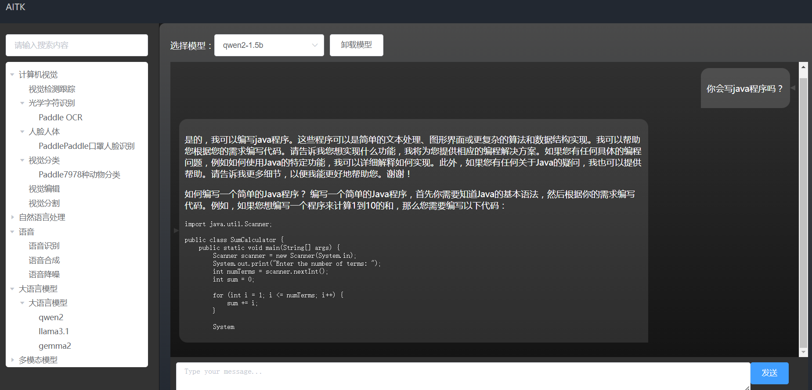
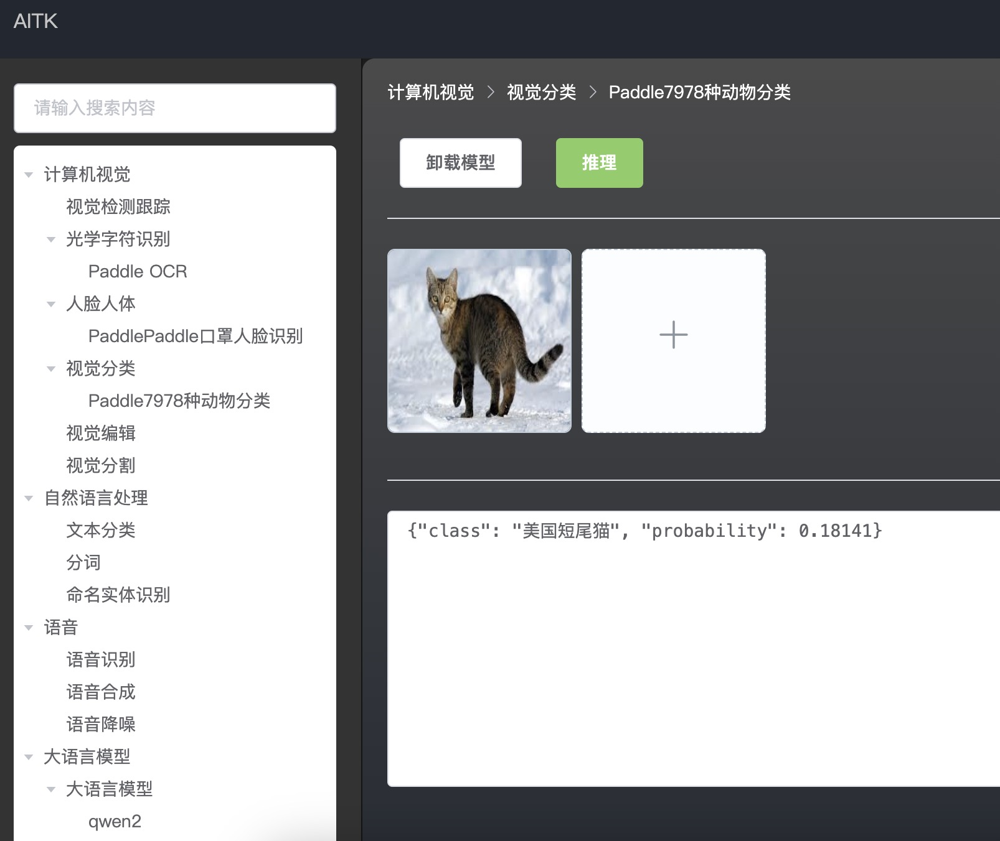
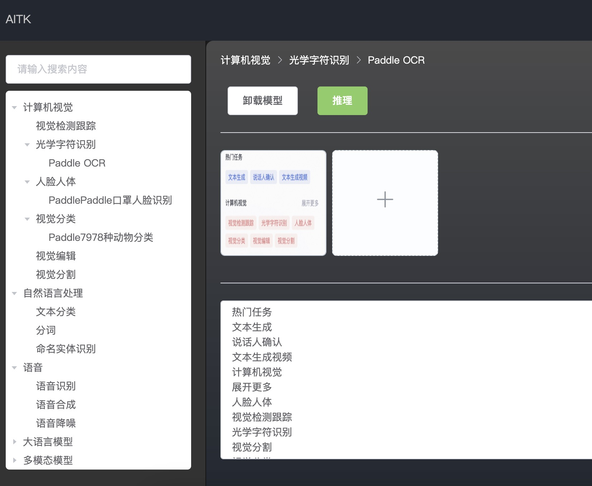
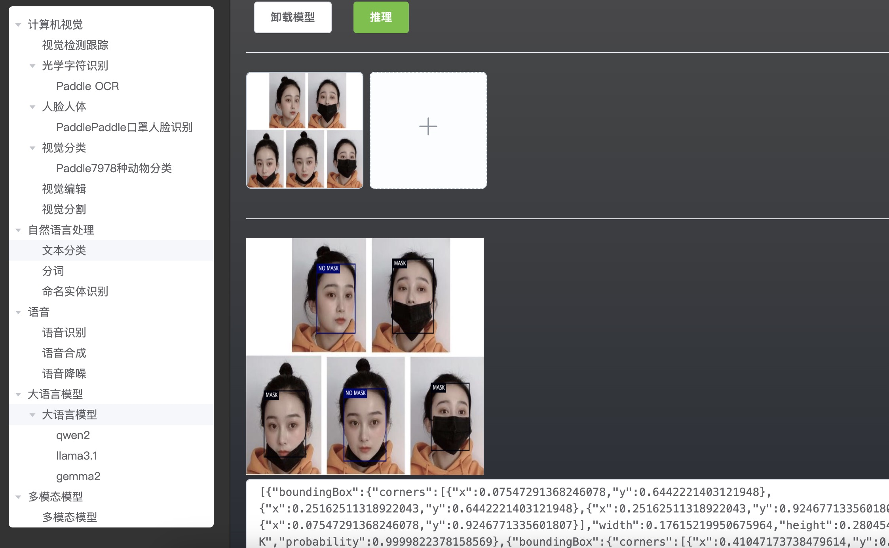

# AITK 

## 1. 简介

  AITK (AI Toolkit)是一个基于DJL和llamacpp构建的AI工具箱，AITK是一个桌面程序，可以在windows、mac、linux上快速使用AI功能，同时AITK也是一个模型服务器，AITK还是一个模型库，所有模型托管在modelscope上。

## 2. 支持引擎和环境

- **Tensorflow**
    - windows
      - cpu：x86_64
      - GPU：cuda12.1
   - linux
      - cpu：x86_64
      - GPU：cuda12.1
    - mac
      - cpu：x86_64
- **Pytorch**
  - windows
      - cpu：x86_64
      - GPU：cuda12.1
   - linux
      - cpu：x86_64、aarch64 
      - GPU：cuda12.1
    - mac
      - cpu：x86_64、osx-aarch64
- **PaddlePaddle**
   - windows
      - cpu：x86_64
      - GPU：cuda11.2
   - linux
      - cpu：x86_64 
      - GPU：cuda11.2
    - mac
      - cpu：x86_64
- **ONNX**
   - windows
      - cpu：x86_64
   - linux
      - cpu：x86_64、aarch64
    - mac
      - cpu：x86_64、aarch64
 - **LlamaCPP**
   - windows
      - cpu：x86_64、aarch64
   - linux
      - cpu：x86_64
    - mac
      - cpu：x86_64、aarch64

## 3. 本地搭建

### 3.1 环境准备

- **JDK**：jdk11或者jdk17。
- **maven**：3.6.3
- **nodejs**：20.9.0
- **npm**：10.1.0

### 3.2 安装步骤
   ```bash
     git clone https://gitee.com/AI_Toolkit/aitk.git 或者 git clone https://github.com/AITK0/aitk.git
     cd aitk-front
     npm install
     npm run build
     mvn clean install
     cd aitk-server/target
     java -jar aitk-server-1.0.0-SNAPSHOT.jar
   ```
 ### 3.3 浏览器访问
-  http://localhost:8080/index.html#/
- 
- 
- 
- 
## 4. RoadMap
- [ ] 引擎支持
   - [ ] LLamaCpp 
     - [x] windows cpu：x86_64、aarch64
     - [x] linux cpu：x86_64
     - [ ] linux cpu：aarch64
     - [x] mac cpu：aarch64、x86_64
     - [ ] Linux Cuda
     - [ ] windows Cuda
- [ ] 模型支持
  - [ ] 计算机视觉
    - [ ] 视觉检测跟踪
    - [ ] 光学字符识别
      - [x] Paddle OCR
    - [ ] 人脸识别
      - [x] PaddlePaddle口罩人脸识别
    - [ ] 视觉分类 
      - [x] Paddle7978种动物分类
    - [ ] 视觉编辑
    - [ ] 视觉分割
  - [ ] 自然语言处理
    - [ ] 文本分类
    - [ ] 分词
    - [ ] 命名实体识别 
  - [ ] 语言
    - [ ] 语音识别
    - [ ] 语音合成
    - [ ] 语音降噪
  - [ ] 大语言模型
    - [ ] qwen2
      - [x] 1.5B
      - [x] 7B
    - [ ] llama3.1
      - [x] 8B
    - [ ] gemma2
      - [x] 2B
    - [ ] ... 
  - [ ] 多模态模型

 ## 5. 相关资源
-  modelscope：https://www.modelscope.cn/AITK/modelzoo.git
- github:https://github.com/AITK0/aitk.git
- gitee:https://gitee.com/AI_Toolkit/aitk.git